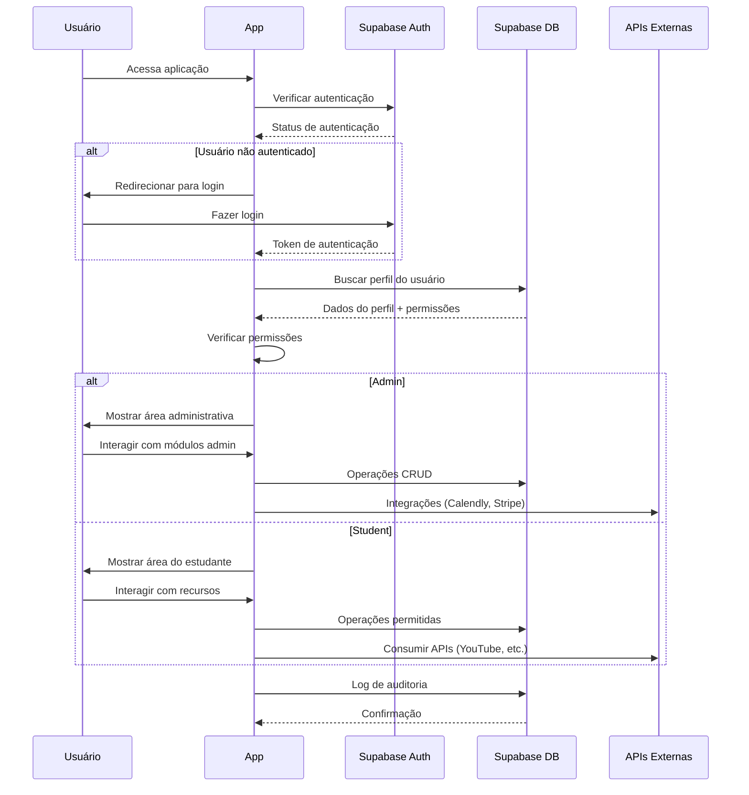
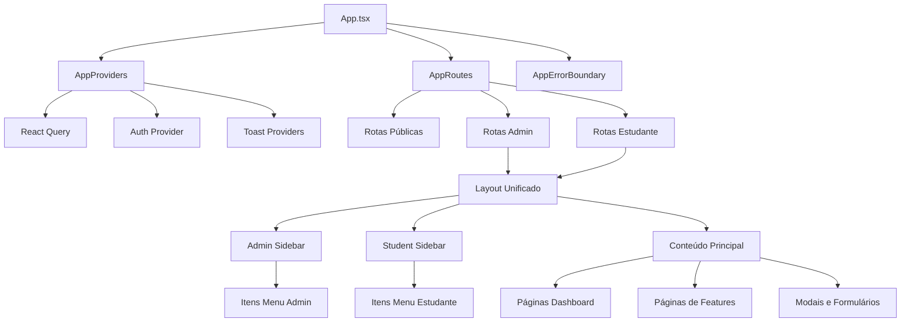

# Flowchart do Sistema Portal Educacional

## Arquitetura Geral do Sistema

```mermaid
flowchart TD
    %% Entry Points
    Start([Usuário Acessa Sistema]) --> Auth{Autenticado?}
    
    %% Authentication Flow
    Auth -->|Não| Login[Login Page]
    Login --> AuthTypes{Tipo de Auth}
    AuthTypes --> EmailAuth[Email/Password]
    AuthTypes --> SocialAuth[Google OAuth]
    AuthTypes --> MagicLink[Magic Link]
    
    EmailAuth --> AuthValidation{Válido?}
    SocialAuth --> AuthValidation
    MagicLink --> AuthValidation
    
    AuthValidation -->|Não| AuthError[Erro de Autenticação]
    AuthError --> Login
    
    AuthValidation -->|Sim| UserProfile[Carregar Perfil]
    
    %% User Profile & Permissions
    UserProfile --> PermissionCheck{Verificar Permissões}
    
    PermissionCheck --> AdminAccess{Admin Access?}
    PermissionCheck --> StudentAccess{Student Access?}
    PermissionCheck --> BannedCheck{Usuário Banido?}
    
    BannedCheck -->|Sim| BannedPage[Tela de Acesso Negado]
    
    %% Admin Flow
    AdminAccess -->|Sim| AdminDash[Admin Dashboard]
    AdminDash --> AdminModules{Módulos Admin}
    
    AdminModules --> UserMgmt[Gestão de Usuários]
    AdminModules --> CRMModule[Sistema CRM]
    AdminModules --> MentoringAdmin[Gestão de Mentorias]
    AdminModules --> CreditsAdmin[Gestão de Créditos]
    AdminModules --> SuppliersAdmin[Gestão de Fornecedores]
    AdminModules --> PartnersAdmin[Gestão de Parceiros]
    AdminModules --> ToolsAdmin[Gestão de Ferramentas]
    AdminModules --> NewsAdmin[Gestão de Notícias]
    AdminModules --> BonusAdmin[Gestão de Bônus]
    AdminModules --> TasksAdmin[Gestão de Tarefas]
    AdminModules --> PermissionsAdmin[Gestão de Permissões]
    AdminModules --> AuditAdmin[Auditoria e Logs]
    AdminModules --> ConfigAdmin[Configurações]
    
    %% Student Flow
    StudentAccess -->|Sim| StudentDash[Student Dashboard]
    StudentDash --> StudentModules{Módulos Estudante}
    
    StudentModules --> MyCredits[Meus Créditos]
    StudentModules --> MySuppliers[Meus Fornecedores]
    StudentModules --> StudentMentoring[Mentoria]
    StudentModules --> SuppliersView[Fornecedores]
    StudentModules --> PartnersView[Parceiros]
    StudentModules --> ToolsView[Ferramentas]
    StudentModules --> LiviAI[Livi AI]
    
    %% CRM System Detail
    CRMModule --> CRMFeatures{Features CRM}
    CRMFeatures --> LeadMgmt[Gestão de Leads]
    CRMFeatures --> PipelineMgmt[Gestão de Pipelines]
    CRMFeatures --> CRMReports[Relatórios CRM]
    CRMFeatures --> CRMNotifications[Notificações]
    CRMFeatures --> WebhookMgmt[Gestão de Webhooks]
    CRMFeatures --> CRMTags[Gestão de Tags]
    CRMFeatures --> CustomFields[Campos Customizados]
    
    %% Mentoring System Detail
    MentoringAdmin --> MentoringFeatures{Features Mentoria}
    MentoringFeatures --> CatalogMgmt[Gestão de Catálogo]
    MentoringFeatures --> EnrollmentMgmt[Gestão de Inscrições]
    MentoringFeatures --> SessionMgmt[Gestão de Sessões]
    MentoringFeatures --> MaterialsMgmt[Gestão de Materiais]
    MentoringFeatures --> ExtensionsMgmt[Gestão de Extensões]
    
    StudentMentoring --> StudentMentoringFeatures{Features Mentoria Estudante}
    StudentMentoringFeatures --> MyEnrollments[Minhas Inscrições]
    StudentMentoringFeatures --> MySessions[Minhas Sessões]
    StudentMentoringFeatures --> MyMaterials[Meus Materiais]
    
    %% Credits System
    CreditsAdmin --> CreditsFeatures{Features Créditos}
    CreditsFeatures --> CreditPackages[Pacotes de Créditos]
    CreditsFeatures --> CreditTransactions[Transações]
    CreditsFeatures --> CreditSubscriptions[Assinaturas]
    CreditsFeatures --> CreditSettings[Configurações]
    
    MyCredits --> StudentCreditsFeatures{Features Créditos Estudante}
    StudentCreditsFeatures --> CreditBalance[Saldo de Créditos]
    StudentCreditsFeatures --> CreditHistory[Histórico]
    StudentCreditsFeatures --> PurchaseCredits[Comprar Créditos]
    
    %% Livi AI System
    LiviAI --> LiviFeatures{Features Livi AI}
    LiviFeatures --> ChatSessions[Sessões de Chat]
    LiviFeatures --> AIMessages[Mensagens IA]
    LiviFeatures --> SessionHistory[Histórico de Sessões]
    LiviFeatures --> CreditConsumption[Consumo de Créditos]
    
    %% Suppliers System
    SuppliersAdmin --> AdminSupplierFeatures{Features Fornecedores Admin}
    AdminSupplierFeatures --> SupplierCRUD[CRUD Fornecedores]
    AdminSupplierFeatures --> SupplierCategories[Categorias]
    AdminSupplierFeatures --> SupplierReports[Relatórios]
    
    MySuppliers --> MySupplierFeatures{Features Meus Fornecedores}
    MySupplierFeatures --> AddSupplier[Adicionar Fornecedor]
    MySupplierFeatures --> SupplierBrands[Marcas]
    MySupplierFeatures --> SupplierContacts[Contatos]
    MySupplierFeatures --> SupplierComments[Comentários]
    MySupplierFeatures --> SupplierRatings[Avaliações]
    MySupplierFeatures --> SupplierFiles[Arquivos]
    
    %% Database Layer
    subgraph Database["🗄️ Supabase Database"]
        direction TB
        AuthTables[auth.users]
        ProfilesTables[profiles]
        CRMTables[crm_leads, crm_pipelines, etc.]
        MentoringTables[mentoring_catalogs, mentoring_enrollments, etc.]
        CreditTables[user_credits, credit_transactions, etc.]
        SupplierTables[my_suppliers, suppliers, etc.]
        AuditTables[audit_logs, security_alerts]
        LiviTables[livi_ai_sessions, livi_ai_messages]
    end
    
    %% External Integrations
    subgraph Integrations["🔌 Integrações Externas"]
        Calendly[Calendly API]
        Stripe[Stripe Payments]
        YouTube[YouTube API]
        EmailService[Email Service]
    end
    
    %% Security & Monitoring
    subgraph Security["🛡️ Segurança & Monitoramento"]
        RLS[Row Level Security]
        AuditLogs[Logs de Auditoria]
        SecurityAlerts[Alertas de Segurança]
        PermissionValidation[Validação de Permissões]
    end
    
    %% Connect to Database
    UserMgmt -.-> ProfilesTables
    CRMModule -.-> CRMTables
    MentoringAdmin -.-> MentoringTables
    CreditsAdmin -.-> CreditTables
    SuppliersAdmin -.-> SupplierTables
    MySuppliers -.-> SupplierTables
    LiviAI -.-> LiviTables
    
    %% Connect to Security
    PermissionCheck -.-> RLS
    UserProfile -.-> PermissionValidation
    AdminDash -.-> AuditLogs
    
    %% Connect to Integrations
    SessionMgmt -.-> Calendly
    PurchaseCredits -.-> Stripe
    StudentDash -.-> YouTube
    
    %% Error Handling
    Auth -->|Erro| ErrorBoundary[Error Boundary]
    AdminDash -->|Erro| ErrorBoundary
    StudentDash -->|Erro| ErrorBoundary
    ErrorBoundary --> ErrorPage[Página de Erro]
    ErrorPage --> Reload[Recarregar Aplicação]
    
    %% Layout System
    AdminDash -.-> AdminLayout[Admin Layout + Sidebar]
    StudentDash -.-> StudentLayout[Student Layout + Sidebar]
    
    %% Performance Optimizations
    subgraph Performance["⚡ Otimizações"]
        LazyLoading[Lazy Loading]
        ReactQuery[React Query Cache]
        VirtualLists[Listas Virtualizadas]
        OptimizedRoutes[Rotas Otimizadas]
    end
    
    AdminModules -.-> Performance
    StudentModules -.-> Performance
    
    %% Styling
    classDef adminNode fill:#3b82f6,stroke:#1e40af,stroke-width:2px,color:#fff
    classDef studentNode fill:#10b981,stroke:#047857,stroke-width:2px,color:#fff
    classDef systemNode fill:#8b5cf6,stroke:#6d28d9,stroke-width:2px,color:#fff
    classDef errorNode fill:#ef4444,stroke:#dc2626,stroke-width:2px,color:#fff
    classDef dbNode fill:#f59e0b,stroke:#d97706,stroke-width:2px,color:#fff
    
    class AdminDash,AdminModules,UserMgmt,CRMModule,MentoringAdmin,CreditsAdmin adminNode
    class StudentDash,StudentModules,MyCredits,MySuppliers,StudentMentoring studentNode
    class Database,Security,Integrations,Performance systemNode
    class ErrorBoundary,ErrorPage,BannedPage errorNode
    class AuthTables,ProfilesTables,CRMTables,MentoringTables dbNode
```

## Fluxo de Dados Principal

```mermaid
sequenceDiagram
    participant U as Usuário
    participant A as App
    participant Auth as Supabase Auth
    participant DB as Supabase DB
    participant API as APIs Externas
    
    U->>A: Acessa aplicação
    A->>Auth: Verificar autenticação
    Auth-->>A: Status de autenticação
    
    alt Usuário não autenticado
        A->>U: Redirecionar para login
        U->>Auth: Fazer login
        Auth-->>A: Token de autenticação
    end
    
    A->>DB: Buscar perfil do usuário
    DB-->>A: Dados do perfil + permissões
    
    A->>A: Verificar permissões
    
    alt Admin
        A->>U: Mostrar área administrativa
        U->>A: Interagir com módulos admin
        A->>DB: Operações CRUD
        A->>API: Integrações (Calendly, Stripe)
    else Student
        A->>U: Mostrar área do estudante
        U->>A: Interagir com recursos
        A->>DB: Operações permitidas
        A->>API: Consumir APIs (YouTube, etc.)
    end
    
    A->>DB: Log de auditoria
    DB-->>A: Confirmação
```

## Estrutura de Componentes

```mermaid
graph TD
    App[App.tsx] --> AppProviders[AppProviders]
    App --> AppRoutes[AppRoutes]
    App --> AppErrorBoundary[AppErrorBoundary]
    
    AppProviders --> QueryClient[React Query]
    AppProviders --> AuthProvider[Auth Provider]
    AppProviders --> Toasters[Toast Providers]
    
    AppRoutes --> PublicRoutes[Rotas Públicas]
    AppRoutes --> AdminRoutes[Rotas Admin]
    AppRoutes --> StudentRoutes[Rotas Estudante]
    
    AdminRoutes --> UnifiedLayout[Layout Unificado]
    StudentRoutes --> UnifiedLayout
    
    UnifiedLayout --> AdminSidebar[Admin Sidebar]
    UnifiedLayout --> StudentSidebar[Student Sidebar]
    UnifiedLayout --> MainContent[Conteúdo Principal]
    
    AdminSidebar --> AdminMenuItems[Itens Menu Admin]
    StudentSidebar --> StudentMenuItems[Itens Menu Estudante]
    
    MainContent --> DashboardPages[Páginas Dashboard]
    MainContent --> FeaturePages[Páginas de Features]
    MainContent --> FormModals[Modais e Formulários]
```
